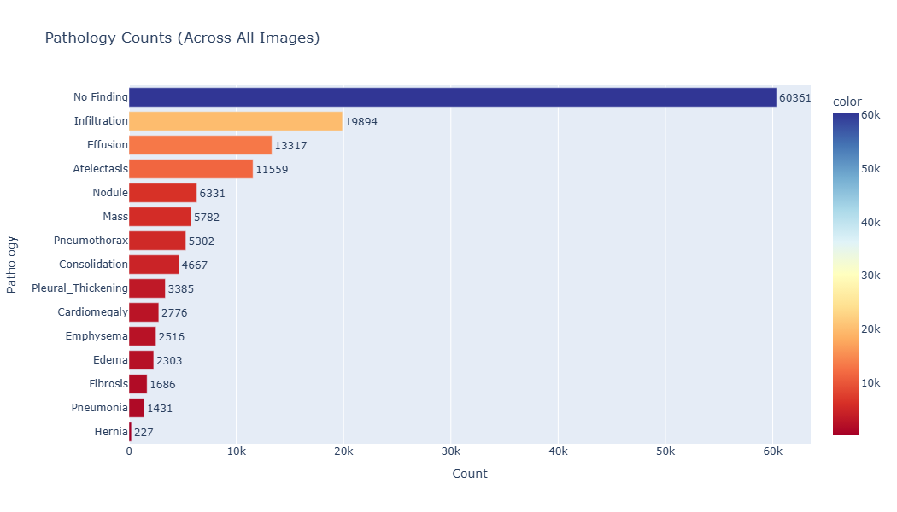
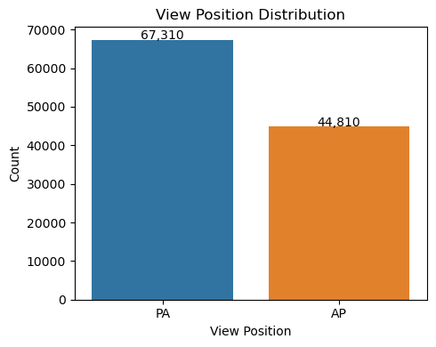
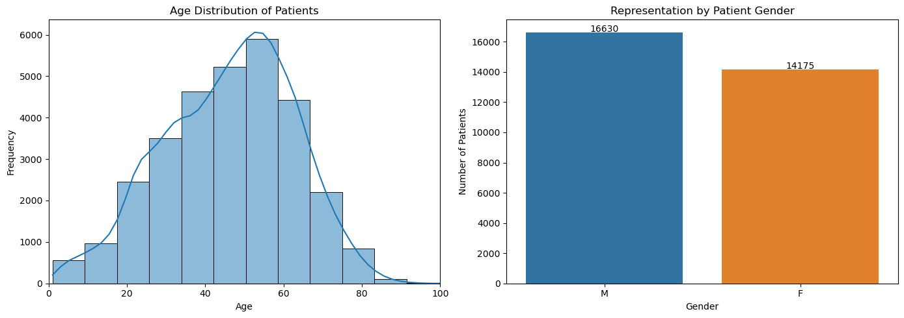
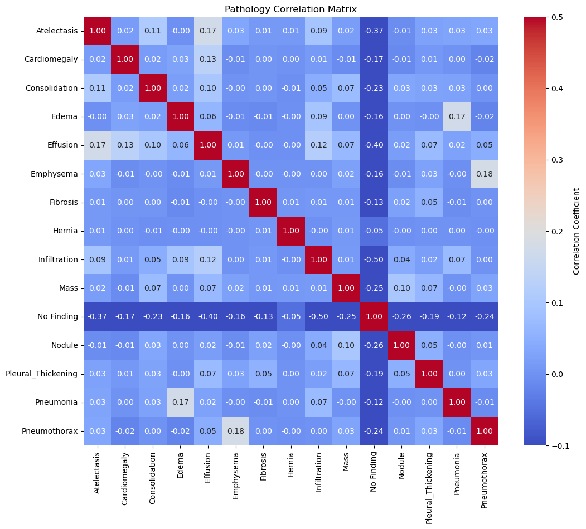
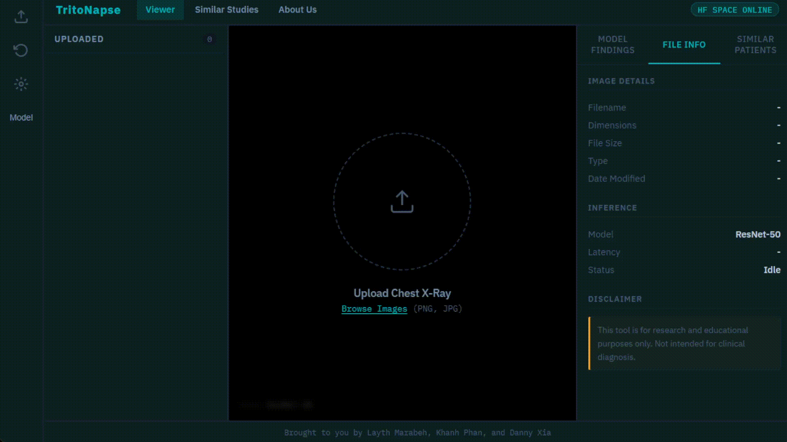

# NIH Chest X-Ray Classification 
**Final Report:** [PDF](final_report.pdf)     
**Authors:** Layth Marabeh, Khanh Phan, Danny Xia       
**Reach Project Demo:** https://khanhphan.com/NIH-XRay-Segmentation/        
**HuggingFace Space:** https://huggingface.co/spaces/k-phantastic/TritoNapse
**Dataset Source:** https://www.kaggle.com/datasets/nih-chest-xrays/data

---

## Overview 

This repository contains our capstone project in building a multi-label chest X-ray pathology classification system that studies the setup for three different deep learning architectures on the [NIH Chest X-ray](https://www.kaggle.com/datasets/nih-chest-xrays/data) dataset from Kaggle. 

### Models

| Model | Author | Architecture | Resolution 
|---|---|---|---
| [DenseNet-121](Densenet/README.md) (baseline)| Layth Marabeh | CNN, dense connections | 224x224 
| [ResNet-50](ResNet50/README.md) | Khanh Phan | CNN, residual skip connections | 512x512 
| MedViT  | Danny Xia | Vision transformer + metadata fusion | 224x224 

Each model was independently developed and trained; top to bottom being our intiially hypothesized worst to best in performance. All share similar image preprocessing and patient stratified validation/test set methodologies. 

---

## Repository Structure

```
Root
├── Densenet/                   # DenseNet-121 training pipeline (Layth)
│   └── ...
├── ResNet50/                   # ResNet-50 training pipeline (Khanh)
│   └── ...
├── MedVIT/                     # Optimized MedViT pipeline (Danny)
│   └── ...
│
├── dataset_info/               # Supporting documentation (From Kaggle dataset)
│   └── ...
├── data/
│   ├── eda_plots/              # Image folder for plot screenshots
│   ├── BBox_List_2017.csv      # Bounding boxes (From Kaggle dataset)               
│   └── Data_Entry_2017.csv     # Metadata file supporting all images (From Kaggle dataset)
├── images/                     # Directory setup for images (From Kaggle dataset)
│   ├── images_001/
│   │   └── images/
│   │       └── *.png
│   ├── images_002/
│   ...
│   └── images_012/
│
├── docs/                       # Frontend and supporting files
│   ├── index.html              # Fujifilm Synapse inspired UI
│   ├── style.css               
│   └── main.js                 
│
├── metadata_eda.ipynb          # EDA: label distributions, demographics, bounding boxes
├── data_loader.ipynb           # Vestige file: Used for setting up data_loader.py
└── pipeline_check.ipynb        # Vestige file: Used for sanity check and testing paths

```

---

## Setup

Further information on dependencies located in model's respective README.md files. Each file utilizing the images contains setup for file paths if location differs from the recommended above. 

1. Upon cloning repository, install any remaining dependencies using our `requirements.txt`
```bash
pip install -r requirements.txt
```
Notably, an appropriate PyTorch version should be chosen relative to the system the training and inference is running on.

2. Download the dataset from [Kaggle](https://www.kaggle.com/datasets/nih-chest-xrays/data) and organize the image folders under `images/` as recommended in the above Repository Structure section. 


---

## Dataset

As overviewed in the [supplementary report](dataset_info/README_CHESTXRAY.pdf) from Kaggle, the dataset includes 112,120 frontal-view X-ray images of 30,805 patients, with text-mined disease labels. Each image is a 1024x1024 PNG file.

#### *Figure 1: Full class counts across all images* 

---

## Exploratory Data Analysis
Exploratory data analysis on the metadata file, `Data_Entry_2017.csv` is performed in `metadata_eda.ipynb`. Checking our understanding of from the EDA, our initial testing of loading the dataset as well as various transforms is performed through `data_loader.ipynb` and `pipeline_check.ipynb`. 

>None of these notebooks are required to be ran for the setup, training, or evaluation of the models. 

#### *Figure 2: View position distribution in full data set (AP vs PA)* 


#### *Figure 3: Patient demographics as defined in `Data_Entry_2017.csv`* 


#### *Figure 4: Comorbidity matrix, showing few clear trends* 


---

## Modeling Workflow
1. Set up images in appropriate directory (see example path setup above)
2. Reference model README.md for detailed instruction on tuning, training, and evaluation

---

## Results

| Model | Best Macro AUC | 
|---|---|
| DenseNet-121 | 0.8242 | 
| ResNet-50 | 0.8162 |
| MedViT | 0.8167  |

See individual model README.md files for additional AUC breakdowns and hyperparameter details.

--- 

## Frontend Draft
**HuggingFace Space:** https://huggingface.co/spaces/k-phantastic/TritoNapse


Introducing TritoNapse- a ploy on UCSD's mascot and Fujifilm's X-ray analysis software, Synapse! As part of our reach goal in building an tangible UI for seeing different model inferences, we created a draft of an application that utilizes the completed trained weights to predict pathologies:

**Input:** A frontal-view chest X-ray image (PNG or JPG)  
**Output:** Predicted probabilities for each thoracic pathology (14 conditions + No Finding)

#### *Figure 5: Demo of website* 


> This tool is a proof of concept built for research and educational purposes as part of our capstone study. **It is not intended for clinical dianosis of any kind,**

### Deployment 
Each of the model checkpoints are loaded on HuggingFace Spaces with [gradio](https://www.gradio.app/). The website is able to make an API call to retrieve the pathology predictions. 

Each model weights are loaded through each respective checkpoint file, which can be seen in the `model_checkpoints/` folder in the HuggingFace repository. 

### Current Features
Many features were storyboarded with assistance from LLM wrangling of the website's javascript. Current implementation in our early stage include: 
| Feature | Description |
|---|---|
| **Image Viewer** | Shows the uploaded file as if performing X-ray diagnostics |
| **Model Switcher** | Toolbar popup to switch between our three models, reruns inference upon selection |
| **Findings Sidebar** | Per-pathology confidence predictions |
| **Image Adjustment** | Exposure and contrast sliders using CSS `filter` (purely visual) |
| **Series list** | Left sidebar tracking all uploaded images with thumbnails |
| **File Info Panel** | Relevant file details/statistics |

### Further Reach Features
This type of tool, while useful in part of our data science lifestyle, should actually be subject to proper production planning and user testing. That being said, early improvements and desires are brainstormed as follows: 

| Feature | Goal |
|---|---|
| **Heatmap** | Similar to Grad-CAM to see common areas of pathology  |
| **Similar Patient Stats** | Method of showing anonymized patients with similar diagnosis for prognosis and planning of care |
| **Annotation** | Further implementation like real X-ray software, with way to save file |
| **Progression Animation** | Show change over time of patient's X-ray across multiple visits |
| **Agent/LLM** | Creation of alternative means to tie previous features |

